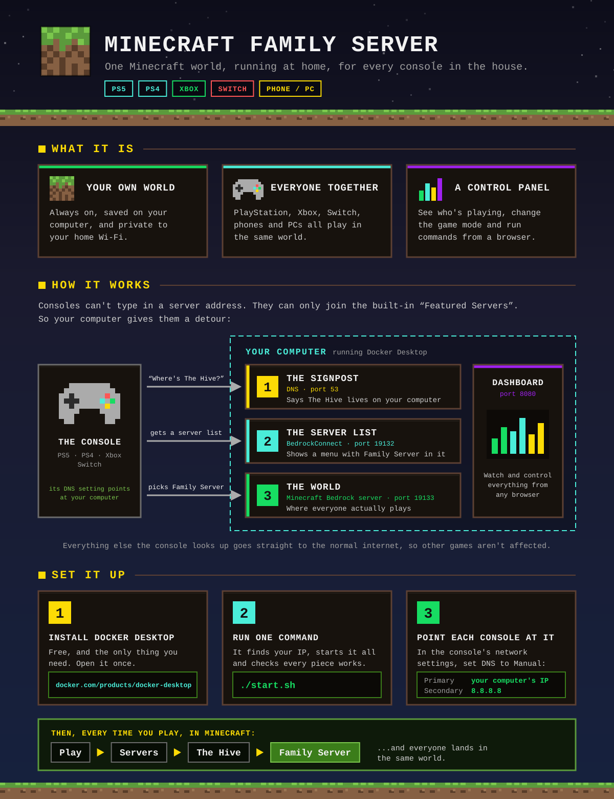

# Minecraft Family Server


A self-hosted **Minecraft Bedrock Edition** dedicated server with a custom **Minecraft-themed web dashboard** for monitoring and management. Built for cross-play between **PS4, PS5, Xbox and Nintendo Switch**. The only thing you install is Docker Desktop.


[](https://github.com/lalomorales22/minecraft-family-server)

---

<p align="center">
  
</p>

---

## Quick Start

**1. Install [Docker Desktop](https://www.docker.com/products/docker-desktop/)** (free) and open it once.

**2. Download this project and start it:**

```bash
git clone https://github.com/lalomorales22/minecraft-family-server.git
cd minecraft-family-server
./start.sh
```

**3. Follow the "How to Join" box** in the dashboard that opens (http://localhost:8080). It shows the two numbers to type into each console and where to type them.

That's it. `./start.sh` finds your computer's address, starts everything, checks that each piece is really working, and tells you if something isn't. It's safe to run again any time — it's also the fix for most problems.

| Command | What it does |
|---|---|
| `./start.sh` | Start (or repair) everything and open the dashboard |
| `./stop.sh` | Stop everything. Your world stays saved in `server-data/` |

> **Requirements:** a Mac with Docker Desktop, on the same Wi-Fi / network as the consoles, and a free Microsoft account for each player. No Java, Python, Homebrew or `sudo` needed.
>
> **Console subscriptions:** Nintendo requires a **Nintendo Switch Online** membership to open the Servers tab on a Switch, even for a server in your own house, and there is no supported way around it. PlayStation's Servers tab normally needs PlayStation Plus, but see [Joining from PlayStation without the Servers tab](#joining-from-playstation-without-the-servers-tab). Phones, tablets and PCs need no subscription.

---

## What's Inside

`./start.sh` runs four small containers:

| Component | Description |
|---|---|
| **Bedrock Dedicated Server** | The official Minecraft server — your world lives here |
| **BedrockConnect** | Shows consoles a server list with "Family Server" in it |
| **DNS** | Sends consoles to BedrockConnect when they pick a Featured Server |
| **Web Dashboard** | Minecraft-themed control panel with setup guide and live monitoring |

### How It All Works Together

Consoles (PlayStation, Xbox, Switch) can't type in custom server addresses — they can only connect to "Featured Servers" like The Hive. So you point the console's DNS at your computer. When the console looks up a Featured Server, it gets sent to **BedrockConnect** instead, which shows a server list with your **Family Server** in it. Pick it, and you're moved to the real Bedrock server.

```
Console → DNS lookup (port 53) → BedrockConnect (port 19132) → Server list
                                                                   ↓
                                                        "Family Server" selected
                                                                   ↓
                                                  Bedrock Dedicated Server (port 19133)
```

Every other DNS lookup is passed straight through to the internet, so the console's other games and apps are unaffected.

## Features

### Dedicated Server
- 24/7 Minecraft Bedrock server running in Docker
- Persistent world data saved to `server-data/`
- Supports 10+ concurrent players with cross-play
- Auto-restarts on crash and after reboots

### Web Dashboard
- **How to Join** — per-console steps with your real IP filled in, a live Setup Check of every piece, and a QR code that opens the dashboard on your phone
- **Backups** — automatic snapshots while people play, one-click restore
- **Worlds** — keep several worlds (a creative one, a survival one, one per kid) and switch between them
- **World map** — a top-down map of everything explored and built, with live player markers
- **AI Builder** — describe a build in words, preview it, and have it placed in the world (with Undo)
- **Messages** — show "Dinner's ready!" on every player's screen from your phone
- **Player actions** — heal, give a starter kit, teleport, switch one player's game mode, make an operator
- **Real-time server status** — online/offline beacon, latency, version
- **Player tracking** — see who's connected, join/leave activity feed
- **Resource monitoring** — CPU, memory, network usage with visual bars
- **Player history chart** — 24-hour player count graph
- **Server settings** — gamemode, difficulty, cheats and max players, saved across restarts
- **Server console** — view logs and send commands from the browser
- **Server controls** — start, stop, restart with one click
- **Fully responsive** — works on desktop, tablet, and phone
- **Minecraft UI theme** — pixel fonts, block textures, dirt/stone aesthetic

---

## Family Features

Everything here is in the dashboard at http://localhost:8080.

### Messages

Type a message (or tap a preset like **Dinner's ready!**) in **Messages & Quick Actions**. It appears in big letters on every player's screen, in chat, and with a sound.

### Player actions

Tap a player's name in the **Players** panel to heal and feed them, hand them a starter kit, switch just them between Creative and Survival, make them an operator, send them to another player, or bring everyone to them.

### Backups

The world is backed up automatically every three hours while people are playing, plus once a night at 4 am. Nothing is copied when nobody has played. **Back up now** makes one on demand.

**Restore** puts the world back exactly as it was at that moment. Players are disconnected for about half a minute while it happens. The current world is backed up first ("Before a restore"), so a restore can itself be reversed.

Backups are zip files in the `backups/` folder. The newest 8 automatic and 14 nightly ones are kept per world; ones you make yourself are kept until you delete them.

### Worlds

**Start a new world** creates another world next to the current one and switches everyone to it. **Switch to this** moves everyone to a different world. Each world remembers its own gamemode and difficulty, so a creative world stays creative. Switching restarts the server, so players are disconnected for a moment. No world is deleted by switching.

### World map

A top-down map of the overworld, one pixel per block, drawn from the world's own files. It fills in as players explore and redraws itself about every half minute while the world changes; **Refresh** forces it. Online players show as coloured squares with their names.

Click anywhere to pick a spot. You can then send a player there, or use it as the place for an AI build.

### AI Builder

Describe a build ("a pirate ship with red sails"), press **Design it**, and Claude designs it. You see it from above and from the front, with its size and materials, before anything touches the world. Then choose where it goes (a spot picked on the map, or next to a player) and press **Build it in the world**. It works even when nobody is online.

- **Undo last build** removes the most recent build and puts the land back exactly as it was.
- Builds are up to 64 x 64 x 64 blocks and use about 230 kinds of block. Nothing that explodes, burns or flows hot. There are no stairs, doors or beds, because blocks are placed without a direction.
- A sample castle is included, so you can try building without an API key.

**To turn on new designs** you need an Anthropic API key (designs are made by `claude-opus-5-5`; each one costs a little API credit):

1. Get a key at [console.anthropic.com](https://console.anthropic.com/)
2. Open the `.env` file in this folder and add a line: `ANTHROPIC_API_KEY=your-key-here`
3. Run `./start.sh` again

---

## Device Setup

Every console needs two things:
1. **A Microsoft / Xbox account** signed into Minecraft (free — create one at [xbox.com/create-account](https://xbox.com/create-account))
2. **DNS settings changed** to point to your computer's IP address

> **Easier:** open the dashboard at http://localhost:8080 — its **How to Join** box shows these same steps with your real IP address already filled in.
>
> `./start.sh` also prints the IP. Use it wherever you see `<YOUR_MAC_IP>` below.

---

### PlayStation 5

#### Step 1: Change DNS Settings

1. From the PS5 home screen, go to **Settings** (gear icon, top right)
2. Select **Network**
3. Select **Settings**
4. Select **Set Up Internet Connection**
5. Find your Wi-Fi network in the list and press the **Options button** (three lines) on your controller
6. Select **Advanced Settings**
7. Set the following:
   - IP Address Settings: **Automatic**
   - DHCP Host Name: **Do Not Specify**
   - DNS Settings: **Manual**
     - **Primary DNS: `<YOUR_MAC_IP>`**
     - **Secondary DNS: `8.8.8.8`**
   - MTU Settings: **Automatic**
   - Proxy Server: **Do Not Use**
8. Press **OK** to save

#### Step 2: Sign Into a Microsoft Account in Minecraft

1. Open **Minecraft** on the PS5
2. On the title screen, you should see a prompt to **Sign in with a Microsoft Account**
3. You'll get a code — go to [microsoft.com/link](https://microsoft.com/link) on your phone or computer
4. Enter the code and sign in (or create a free Xbox account)
5. Once signed in, you'll see your Gamertag on the Minecraft title screen

#### Step 3: Join the Family Server

1. From the Minecraft main menu, press **Play**
2. Go to the **Servers** tab (at the top)
3. Scroll down and select **The Hive** (Lifeboat, Mineville, Galaxite and Enchanted Dragons also work — other Featured Servers don't)
4. Instead of the Featured Server, the **BedrockConnect server list** will appear
5. You'll see **"Family Server"** in the list — select it
6. You're in! You should load into the family world

---

### PlayStation 4

#### Step 1: Change DNS Settings

1. From the PS4 home screen, go to **Settings**
2. Select **Network**
3. Select **Set Up Internet Connection**
4. Choose **Use Wi-Fi** (or LAN Cable if wired)
5. Select **Custom**
6. Set the following:
   - IP Address Settings: **Automatic**
   - DHCP Host Name: **Do Not Specify**
   - DNS Settings: **Manual**
     - **Primary DNS: `<YOUR_MAC_IP>`**
     - **Secondary DNS: `8.8.8.8`**
   - MTU Settings: **Automatic**
   - Proxy Server: **Do Not Use**
7. Select **Test Internet Connection** to confirm it works

#### Step 2: Sign Into a Microsoft Account in Minecraft

1. Open **Minecraft** on the PS4
2. On the title screen, press **Sign in with a Microsoft Account**
3. A code will appear on screen — go to [microsoft.com/link](https://microsoft.com/link) on your phone or computer
4. Enter the code and sign in with your Microsoft / Xbox account
5. Your Gamertag will show on the title screen when linked

#### Step 3: Join the Family Server

1. Press **Play** from the main menu
2. Navigate to the **Servers** tab
3. Select **The Hive** (Lifeboat, Mineville, Galaxite and Enchanted Dragons also work — other Featured Servers don't)
4. The **BedrockConnect server list** appears instead
5. Select **"Family Server"** from the list
6. Done — you'll spawn into the family world

---

### Nintendo Switch (Switch 2)

> These instructions work for both the original Nintendo Switch and the Nintendo Switch 2. The menus are the same.

#### Step 1: Change DNS Settings

1. From the Switch home screen, go to **System Settings** (gear icon)
2. Scroll down in the left sidebar and select **Internet**
3. Select **Internet Settings**
4. Your connected Wi-Fi network will show at the top — select it
5. Select **Change Settings**
6. Scroll down to **DNS Settings** and change it from Automatic to **Manual**
   - **Primary DNS: `<YOUR_MAC_IP>`**
   - **Secondary DNS: `8.8.8.8`**
7. Press **Save**
8. Select **Connect to This Network** to test the connection

#### Step 2: Sign Into a Microsoft Account in Minecraft

1. Open **Minecraft** on the Switch
2. On the title screen, you'll see a **Sign in with a Microsoft Account** button on the left
3. Press it — a code will display on screen
4. On your phone or computer, go to [microsoft.com/link](https://microsoft.com/link)
5. Enter the code and sign in (or create a free Xbox account)
6. Back on the Switch, Minecraft will show your Gamertag once linked

#### Step 3: Join the Family Server

1. Press **Play** from the main menu
2. Go to the **Servers** tab at the top
3. Select **The Hive** (Lifeboat, Mineville, Galaxite and Enchanted Dragons also work — other Featured Servers don't)
4. The **BedrockConnect menu** will appear instead of the Featured Server
5. Select **"Family Server"**
6. You'll connect and spawn into the family world

---

### Xbox

1. **Settings** → **General** → **Network settings** → **Advanced settings**
2. Select **DNS settings** → **Manual**
3. **Primary DNS: `<YOUR_MAC_IP>`**, **Secondary DNS: `8.8.8.8`**
4. Open Minecraft → **Play** → **Servers** → select **The Hive** → choose **"Family Server"**

---

### Phone, Tablet or PC

No DNS change needed. In Minecraft: **Play** → **Servers** → **Add Server**, then enter:
- **Server Address:** `<YOUR_MAC_IP>`
- **Port:** `19133`

---

### Joining Each Other (Cross-Play)

Once everyone is connected to the Family Server:
- All players share the same world regardless of which console they're on
- PS4, PS5, and Switch players can all see each other, build together, mine, and explore
- Player progress, builds, and inventory are saved on the server and persist between sessions
- If someone disconnects, they'll respawn where they left off next time they join

---

## Tips for Parents

### Xbox / Microsoft Account Privacy Settings

If any player is a **child account** (under 13), you may need to adjust privacy settings for multiplayer to work:

1. Go to [family.microsoft.com](https://family.microsoft.com)
2. Sign in with the **parent's** Microsoft account
3. Select the child's account
4. Under **Xbox Series X|S, Xbox One, and Windows 10 devices → Privacy & online safety**
5. Make sure these are set to **Allow**:
   - "You can join multiplayer games"
   - "You can communicate outside of Xbox with voice & text"
   - "Others can communicate with voice, text, or invites"

### Keeping the Server Running

Everything runs in Docker with `restart: unless-stopped`, so it will:
- Survive restarts, as long as Docker Desktop is set to open at login (Docker Desktop → Settings → General → **Start Docker Desktop when you sign in**)
- Auto-recover from crashes
- Keep all world data safe in `server-data/`

No terminal window needs to stay open. You only need `./start.sh` again if you stopped it with `./stop.sh`, or if something stops working.

---

## Project Structure

```
minecraft-family-server/
├── start.sh                    # Start / repair everything
├── stop.sh                     # Stop everything
├── docker-compose.yml          # The four containers
├── dns/Dockerfile              # Tiny dnsmasq image for the console DNS redirect
├── dashboard/
│   ├── Dockerfile
│   ├── app.py                  # Flask backend: all the API routes
│   ├── mc.py                   # Talking to the server: commands, logs, players
│   ├── backups.py              # Snapshots and restore
│   ├── worlds.py               # World list, switch, create
│   ├── leveldb_reader.py       # Reads the world's database files directly
│   ├── worldmap.py             # Renders the map tiles
│   ├── builder.py              # Turns a build plan into blocks (and undo)
│   ├── ai.py                   # Asks Claude for a build plan
│   ├── samples/                # Ready-made designs
│   ├── requirements.txt
│   ├── templates/index.html    # Dashboard HTML
│   └── static/                 # Styles + dashboard logic
├── server-data/                # Minecraft world data (auto-created)
├── backups/                    # World backups (auto-created)
├── bedrockconnect/             # Server list shown to consoles (auto-created)
├── players/                    # BedrockConnect player data (auto-created)
├── .env                        # This computer's IP and time zone (auto-created), plus your API key if you add one
└── README.md
```

---

## Dashboard API

The dashboard exposes a REST API on port 8080:

| Endpoint | Method | Description |
|---|---|---|
| `/api/status` | GET | Server status (online, players, version, latency) |
| `/api/setup` | GET | This computer's IP + health of server, BedrockConnect and DNS |
| `/api/players` | GET | Connected players + recent join/leave events |
| `/api/stats` | GET | Docker container stats (CPU, RAM, network) |
| `/api/history` | GET | Player count history (24h) |
| `/api/logs?lines=50` | GET | Recent server console output |
| `/api/settings` | GET / POST | Read or change gamemode, difficulty, cheats, max players |
| `/api/announce` | POST | Show a message on every player's screen |
| `/api/player` | POST | Heal, kit, teleport, gamemode or operator for one player |
| `/api/backups` | GET / POST | List backups, or make one now |
| `/api/backups/restore`, `/delete` | POST | Restore or delete a backup |
| `/api/worlds` | GET | List worlds |
| `/api/worlds/switch`, `/create` | POST | Switch to, or create, a world |
| `/api/map/info`, `/players`, `/height` | GET | Map status, player positions, ground height at a spot |
| `/api/map/tile/<x>/<z>.png` | GET | One 256 x 256 block map tile |
| `/api/map/refresh` | POST | Save the world and redraw the map |
| `/api/ai/status`, `/design/<id>` | GET | Builder status and designs |
| `/api/ai/design`, `/build`, `/undo` | POST | Ask for a design, place it, undo the last build |
| `/api/server/start` | POST | Start the Bedrock server |
| `/api/server/stop` | POST | Stop the Bedrock server |
| `/api/server/restart` | POST | Restart the Bedrock server |
| `/api/command` | POST | Send a command to the server console |

> The dashboard has no password, so anyone on your home network can use everything on it: run commands, restore backups, switch worlds, and (if you added an API key) spend its credit on AI builds. Don't forward port 8080 on your router.

---

## Configuration

### Game Settings

Change **gamemode, difficulty, cheats and max players** in the dashboard's **Server Settings** panel, and the world itself in the **Worlds** panel. A brand-new install starts with a world called FamilyWorld in Creative / Normal with cheats on.

Everything else is in `docker-compose.yml`:

```yaml
environment:
  SERVER_NAME: "Family Server"     # Server name
  VIEW_DISTANCE: 16                # Render distance (chunks)
```

After editing it, run `./start.sh` again. ([Full list of options](https://github.com/itzg/docker-minecraft-bedrock-server#server-properties))

### Port Reference

| Port | Protocol | Used By | Purpose |
|---|---|---|---|
| 53 | UDP/TCP | DNS | Redirects console lookups of Featured Servers |
| 19132 | UDP | BedrockConnect | Server list shown to consoles |
| 19133 | UDP | Bedrock Server | The actual Minecraft server |
| 8080 | TCP | Dashboard | Web dashboard UI and API |

---

## Troubleshooting

**First thing to try for anything:** run `./start.sh` again, then look at the **Setup Check** in the dashboard.

### Console says "Unable to connect to world"
- Check the dashboard's Setup Check shows three green ticks
- Verify the console's Primary DNS is your computer's IP (shown in the dashboard)
- If the Mac firewall is on (**System Settings → Network → Firewall**), allow incoming connections for Docker

### The real Featured Server opens instead of the server list
- Pick **The Hive**, Lifeboat, Mineville, Galaxite or Enchanted Dragons — other Featured Servers aren't redirected
- Double-check the console's Primary DNS, then fully close and reopen Minecraft
- Restart the console's internet connection after changing DNS

### It worked yesterday and now nothing connects
- Your computer's IP address probably changed. Run `./start.sh` — it tells you if it did — and update the Primary DNS on each console
- **Tip:** reserve a fixed IP for this computer in your router (often called "DHCP reservation") so it never changes

### `./start.sh` says a port is already in use
- If you used the older version of this project, press Ctrl+C in its `start-server.sh` window, then run `sudo killall dnsmasq`
- On a Mac, turn off **Internet Sharing** (System Settings → General → Sharing) — it uses port 53
- See what's using a port: `sudo lsof -nP -i :53`

### Server console shows "NetherNet is the only supported transport type"
- Expected, and safe to ignore. Since September 2026 the Bedrock server prefers a new network protocol (NetherNet), but BedrockConnect — the piece that lets consoles in — still uses the classic one (RakNet), so `docker-compose.yml` sets `TRANSPORT: raknet`
- If a future Minecraft update stops consoles from joining, check [BedrockConnect](https://github.com/Pugmatt/BedrockConnect/releases) for a new release, then follow **Updating** below

### Switch says a Nintendo Switch Online membership is required
- That check is Nintendo's and happens on the console before it ever contacts your server, so it applies to home servers too
- Nintendo Switch Online has a free 7-day trial in the eShop, which is a good way to confirm everything works first
- A family membership covers up to eight Nintendo accounts

### Joining from PlayStation without the Servers tab
- PlayStation and Xbox consoles can find servers on the same home network as "LAN games". This server answers that search
- In Minecraft press **Play**, then look in the **Friends** tab (some versions show it under **Worlds**) for a game called **"Join To Open Server List"**. Join it, then pick **Family Server**
- No DNS change is needed for this route. It does not work on Switch
- Whether Sony asks for PlayStation Plus on LAN games hasn't been confirmed here

### "Sign in with Microsoft Account" doesn't appear
- Make sure Minecraft is updated to the latest version
- On PS4/PS5: you may need to sign out and back into PSN first
- On Switch: try closing and reopening Minecraft completely (press X on the home screen to close)

### Players can't see each other in the world
- All players must be signed into **different** Microsoft / Xbox accounts
- For child accounts, check Xbox privacy settings (see Tips for Parents above)

### AI Builder says it needs an API key
- Add `ANTHROPIC_API_KEY=...` to the `.env` file and run `./start.sh` again (see **AI Builder** above)
- "The key was rejected" means the key is mistyped or has no credit

### The map is empty or missing an area
- The map only shows places someone has been. It fills in as players explore
- Press **Refresh** on the map to save the world and redraw right now

### Dashboard shows "OFFLINE"
- A brand-new world takes a minute or two to load
- Look at the logs: `docker logs minecraft-bedrock`

---

## Updating

```bash
git pull
docker compose pull
./start.sh
```

The Minecraft server itself updates to the latest version every time it restarts.

**Coming from the older version** (the one with `setup.sh` / `start-server.sh`)? Stop the old one first (Ctrl+C in its `start-server.sh` window, then `sudo killall dnsmasq`), then run `./start.sh`. Your world in `server-data/` is picked up as-is. Java, dnsmasq and the Python virtualenv are no longer needed.

---

## Tech Stack

- **Minecraft Bedrock Dedicated Server** via [itzg/minecraft-bedrock-server](https://github.com/itzg/docker-minecraft-bedrock-server) Docker image
- **BedrockConnect** by [Pugmatt](https://github.com/Pugmatt/BedrockConnect) — console server list
- **dnsmasq** — DNS redirect for consoles
- **Flask** — Python web framework for the dashboard backend
- **Claude API** (Anthropic Python SDK) — designs for the AI Builder
- **NumPy + Pillow** — map rendering and build previews
- **Leaflet** — the pan-and-zoom world map
- **Docker SDK for Python** — container stats and management
- **Chart.js** — player history graphs
- **Press Start 2P / VT323** — pixel and terminal fonts for the Minecraft theme

---

## License

Personal/family use. Built with love for family game nights.
